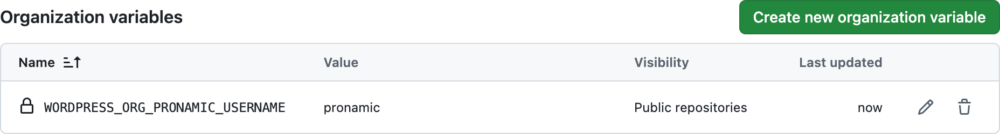
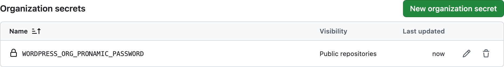
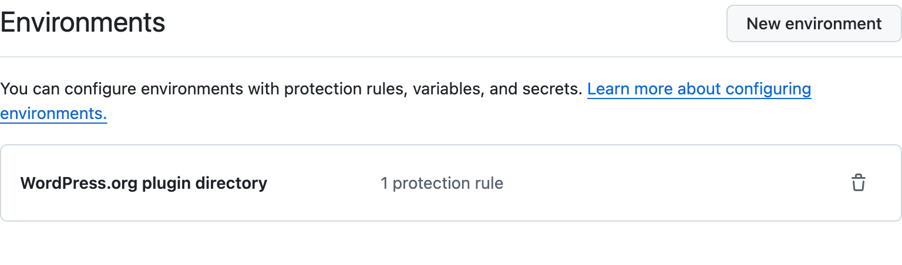
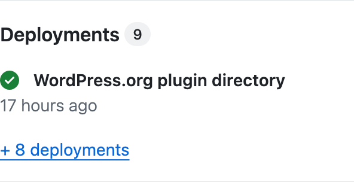

# Github action WordPress.org deploy

## Introduction

### Streamline your WordPress plugin deployment

This GitHub action simplifies deploying your WordPress plugin directly in the WordPress plugin directory.

### Built for WordPress developers

Leveraging PHP instead of bash scripting, this action caters to the preferences of many WordPress developers, offering a familiar and potentially more convenient workflow.

## Usage

This GitHub action can be used to automatically deploy a WordPress plugin to the WordPress.org plugin directory whenever a new release is released via GitHub releases. It is important that the GitHub release contains a distribution archive asset with a filename of the `{name}.{version}.zip` format. The [WP-CLI command `wp dist-archive`](https://developer.wordpress.org/cli/commands/dist-archive/) can be used to create a distribution archive with this filename format.

### Actions secrets and variables

For the WordPress.org login details it can be useful to create a variable and secret at organization level. For example, for the organization Pronamic the following variable and secret are used:

```
${{ vars.WORDPRESS_ORG_PRONAMIC_USERNAME }}
```

```
${{ secrets.WORDPRESS_ORG_PRONAMIC_PASSWORD }}
```

This way, the WordPress login details can be managed in one place and you don't have to do this per repository or environment.

#### Screenshot of GitHub organization actions variables settings.



#### Screenshot of GitHub organization actions secrets settings.



### Environments

The WordPress.org plugin directory can be seen as an environment where the plugin in a GitHub repository can be deployed to. The advantage of this is that GitHub shows the deployments to the WordPress.org plugin directory. And with protection rules you can delay the deployment to WordPres.org until after approval by 1 or more GitHub users.

#### Screenshot of GitHub repository environments settings.



#### Screenshot of GitHub repository homepage deployments.



## Example

```yml
name: Deploy to WordPress.org

on:
  workflow_dispatch:
    inputs:
      tag:
        description: 'Tag to deploy to WordPress.org'
        required: true
        type: string
  release:
    types: [released]

jobs:
  deploy:
    runs-on: ubuntu-latest

    environment:
      name: WordPress.org plugin directory
      url: https://wordpress.org/plugins/salesfeed/

    steps:
      - name: Deploy
        uses: pronamic/action-wordpress-org-plugin-deploy@main
        env:
          GITHUB_TOKEN: ${{ secrets.GITHUB_TOKEN }}
        with:
          username: ${{ vars.WORDPRESS_ORG_PRONAMIC_USERNAME }}
          password: ${{ secrets.WORDPRESS_ORG_PRONAMIC_PASSWORD }}
          tag: ${{ inputs.tag || github.event.release.tag_name }}
          slug: salesfeed
```

## Inspiration

- https://github.com/marketplace/actions/wordpress-plugin-svn-deploy
  - https://github.com/nk-o/action-wordpress-plugin-deploy
- https://github.com/marketplace/actions/wordpress-plugin-readme-assets-update
  - https://github.com/10up/action-wordpress-plugin-asset-update
- https://github.com/marketplace/actions/deploy-to-wordpress-org-svn-repository
  - https://github.com/richard-muvirimi/deploy-wordpress-plugin
- https://github.com/actions/deploy-pages
- https://github.com/actions/upload-pages-artifact

## Development

```
GITHUB_REPOSITORY=pronamic/pronamic-pay-with-rabo-smart-pay-for-woocommerce php release.php
```
